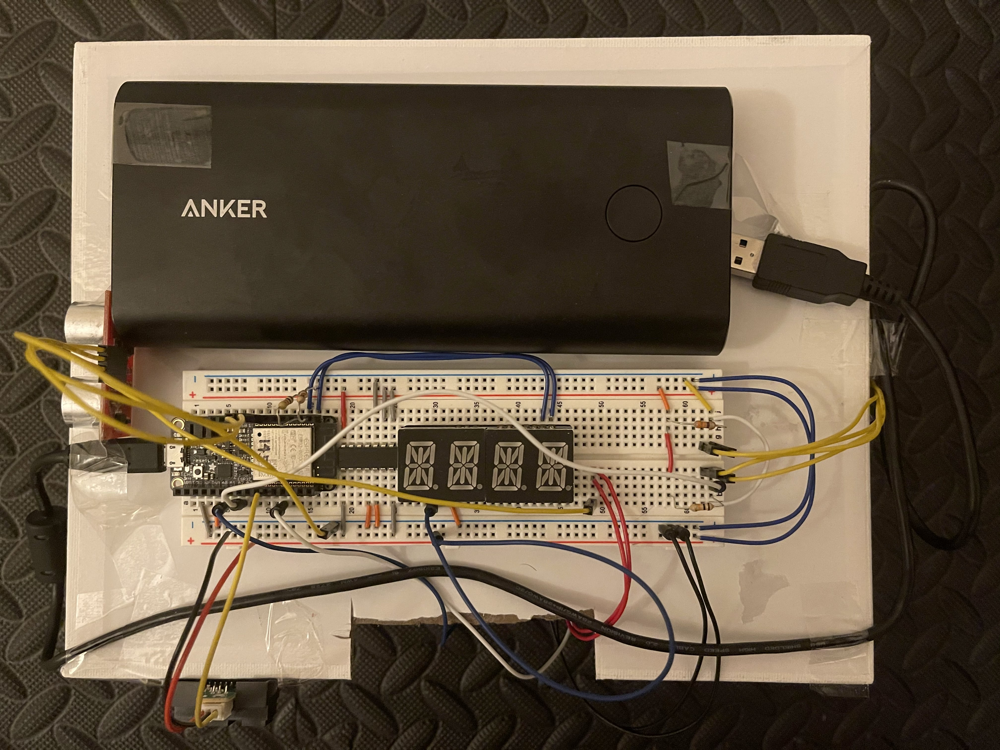

# Quest 5: Cruise Control
Authors: Hang Liu, Hayato Nakamura, Arnaud Harmange

Date: 2020-12-01
-----

## Summary
  The goal of this quest is to create a self driving car that is able to accelerate to, and then maintain a certain speed- and of course decelerate within a small margin of error. Additionally, the car should be able to maintain a course course, also within a small range of error. Finally, the car should be able to detect obstacles that are in its path and avoid colliding with them. In order to do this, The ESP32 and L293D chip are used in conjunction with the ultrasonic sensor, IR sensor, and the optical encoder. All of these components are wired to the provided "dune buggy", and allow it to acheive the desired self driving capabilities. 

## Self-Assessment

### Objective Criteria

| Objective Criterion                                                            | Rating | Max Value  | 
|--------------------------------------------------------------------------------|:------:|:----------:|
| Controls steering, maintains center of course within 25 cm margin of error     | 1      |  1         | 
| Uses PID for speed control, holds fixed speed after startup and before slowdown| 1      |  1         | 
| Stops within 20 cm of the end without collision                                | 1      |  1         | 
| Start and stop instructions issued wirelessly from phone, laptop, or ESP.      | 1      |  1         | 
| Measures wheel speed or distance                                               | 1      |  1         | 
| Uses alpha display to show current distance or speed                           | 1      |  1         | 
| Successfuly traverses A-B in one go, no hits or nudges                         | 1      |  1         | 

### Qualitative Criteria

| Qualitative Criterion | Rating | Max Value  | 
|---------------------------------------------|:-----------:|:---------:|
| Quality of solution | 5 |  5     | 
| Quality of report.md including use of graphics | 3 |  3     | 
| Quality of code reporting | 3 |  3     | 
| Quality of video presentation | 3 |  3     | 

## Solution Design
  This quest is relatively complex and involves many components- both in terms of physical and software components. The dune buggy has controlled via the on board speed controller (ESC) which in turn is controlled by the ESP32 board. The ESP32 is connected to several sensors, specifically the IR sensor, the ultrasonic sensor and the optical encoder sensor. the ultrasonic sensor is primarily used for ranging and detecting any potential obstacles that the car may have to avoid that appear in front of it. The optical encoder is used to detect the wheel speed and therefore allows us to determine the speed at which the vehicle is moving and the distance traveled by the vehicle. The IR sensor is used to detect any walls or obstacles that may appear on the side of the vehicle. This sensor allows the vehicle to maintain a distance of five to ten centimeters from a given obstacle like a wall or guard rail, helping the vehicle maintain the desired course. If the wall is too close or too far from the sensor, the steering is adjusted in such a way that the car is once again within the correct distance of the wall. Using the data from these sensors, we are able to make sure that the vehicle achieves and maintains a given speed, and is able to avoid colliding with any obstacles that may be in front of it, as well as ensure that in maintains the correct course. The software continually polls the sensors, checking that the distance from the walls of the course are maintained, that it will not collide with any obstacles, and that the preset speed is not surpassed or not maintained. The code also allows for wireless remote control of the car, which can be stopped or started, as well as have its cruising speed set. This is done via UDP communication, which transmits the commands using a server running on the raspberry pi. The ESP32 is also wired up to the seven-segment display, which allows us to display the distance traveled by the car or the current speed of the car. 
  
  

## Investigative Question
While the current solution is able to meet the specifications detailed in the quest brief, it is still a fairly rudimentary implementation of cruise control. In order to take this to the next level, some key changes could be made in order to make the cruise control closer to what can be found in modern cars. The first order of business would be to have the Ultrasonic sensor, which could perhaps be swapped out for LIDAR for more frequent and accurate readings, do some additional work. Namely, the sensor at the front of the car would have to continually sense for anything in front of it, and if something is within the sensors range, it would have to be able to measure the change in distance between readings. If the change in distance relative to an object remains the same, then the object is stationary and the car is moving towards it, assuming the car is already moving at constant speed. However, if the changes in distance between readings is decreasing, then we could assume that the object is either moving slower than the car or moving towards it. In either case, the car should begin to slow down in order to attempt to maintain the same differerence between distance measurements. This would result in the car adapting to the speed of objects in front of it, like another car, similar to modern day adaptive cruise control. Additional improvements could include cameras on either side of the car pointing downwards that have the ability to detect demarcations on the road so that the car would be able to adjust its steering more accurately to remain within the guiding lines. 

## Sketches and Photos
- Wiring (Top down view)  
  

  

- Optical Encoder  
  

  

- Front Sensor (Ultrasonic Range Sensor)  
  

  

- Side Sensor (IR Range Finder)
  

  

## Supporting Artifacts
- [Link to Video Presentation](https://youtu.be/0OjLC9YBmUU)  

- [Link to Technical Demonstration](https://youtu.be/mTT-GuJTteU)  

## Modules, Tools, Source Used Including Attribution
- Modules and Tools:
  - Pulse Width Modulation (PWM)
  - Servo
  - H-Bridge
  - Ultreasonic Range Sensor
  - IR Range Finder
  - PID control
  - UDP
  - Node.js
  - Optical Encoder
  - Analog to Digital Converter (ADC)

- Attribution
  - [HC-SR04 using RMT](https://esp32.com/viewtopic.php?f=17&t=5787)
  - [ESPRESSIF RMT](https://docs.espressif.com/projects/esp-idf/en/latest/esp32/api-reference/peripherals/rmt.html)
  - [Ultrasonic Range Sensor (whizzer.bu.edu)](http://whizzer.bu.edu/skills/ultrasonic2)

## References
- https://esp32.com/viewtopic.php?f=17&t=5787
- https://docs.espressif.com/projects/esp-idf/en/latest/esp32/api-reference/peripherals/rmt.html)
- http://whizzer.bu.edu/skills/ultrasonic2
-----

