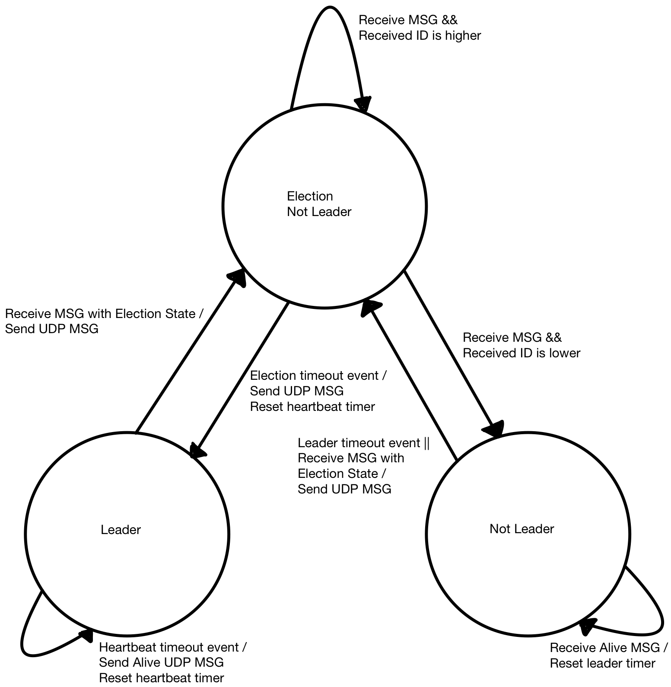

# Quest 4: E-Voting
Authors: Hayato Nakamura, Hang Liu, Arnaud Harmange

Date: 2020-11-13
-----

## Summary
In this quest, we utilizied IR communication between multiple local ESP32 based fobs in order to hold an "election" in which a leader was chosen. The local fobs are able to communicate the information over a wireless network and store votes on a database, allowing remote fobs to participate in the election as well. In this particular case, we were unable to successfully connect the results from one local network to another due to issues with port forwarding. All other components of this quest were completed and functional. Further details regarding this and adaptations made due to these issues are addressed in the Solution Design portion of this report. 

## Self-Assessment

### Objective Criteria

| Objective Criterion                                                      | Rating  | Max Value  | 
|--------------------------------------------------------------------------|:-------:|:----------:|
| Fob performs IR NFC data exchange of vote to another fob (LED indication)| 1       |  1         | 
| Receiving fob communicates vote to Poll Leader via network communication | 1       |  1         | 
| Poll leader (LED indication) is replaced if fails                        | 1       |  1         | 
| Poll Leader reports votes to server database                             | 1       |  1         | 
| Portal allows query to database to show actual vote counts per candidate | 1       |  1         | 
| Operates over mutiple sites or with all available fobs (up to 9)         | 1       |  1         | 
| Investigative question response                                          | 1       |  1         | 

### Qualitative Criteria

| Qualitative Criterion | Rating | Max Value  | 
|---------------------------------------------|:-----------:|:---------:|
| Quality of solution | 5 |  5     | 
| Quality of report.md including use of graphics | 3 |  3     | 
| Quality of code reporting | 3 |  3     | 
| Quality of video presentation | 3 |  3     | 

## Solution Design
  Our solution for the e-voting quest involves the utilization of a bully algorithm in order to elect a poll leader. The fobs are able to send and receive data utilizing the IR transmitting diodes and IR receivers. The fobs are also connected to a local network, which allows them to send data to a server, which the other fobs can access to see the current state of the election, and determine who is the poll leader. In this quest, we worked hard to also implement the feature that would allow for communications of remote fobs using port forwarding and udp protocols. Unfortunately, despite numerous attempts and strategies to get all of our fobs to communicate, we were unable to make this occur. In order to put forward a meaningful demo, we have gathered four of our six fobs (one group member is not located in Boston) in one location. This allows us to hold an election for a poll leader using four unique fobs all on one local network. Using this strategy, we are able to demonstrate that our implementations of IR communication, local network communication, and server and database are all functional. 

  We broke down our code solution into several components: the main function, the UDP functions, the IR functions, as well node js files for the server and database code. The main function contains the code that interprets the current status of the fob and the other fobs and dictates what should happen as a result. It also keeps track of the timers required for the election timeout. The UDP functions handle the non IR communication betwen the fobs. this portion of the code sends and receives data over the local wireless network, allowing all of the fobs to send their "votes" and receive the "results" of the election. The IR portion of the code is able to transmit and receive data using the IR transmitters and recivers, which allows nearby boards to send their votes to each other before they are sent to the central server. The nodejs server and database receive and store the votes as they come in, and allow for the poll leader to access the results. The node js code also displays the voting data in graphs on a webpage that can be accessed from anywhere.  
  
  Our server is created through node.js and runs on our raspberry pi. Mongodb is used to create a collection named "votes" and stores the data send by our fobs.  
Canvasjs is used to plot the votes received by the fobs. A bar graph is used to show the total votes per candidate and each individual vote is shown belown the graph.  
There is a reset button on our website to clear the database if needed.
 

## Investigative Question
  There are a multitude of ways in which a bad actor could influence the election by attacking the voting system we have created. Below are listed five potential security risks along with their respective potential solutions. 
  
- **Signal Jamming**
  Since our system utilizes wireless communications, it is vulnerable to signal jamming attacks. This would mean that some kind of destructive interference would cause the signals from certain ESP32 fobs to not be communicated to the database, therefore causing those votes to not be counted. This would result in only a partial vote and therefore a rigged election. A potential solution to this would be to not allow the election to take place without all fobs "checking in" and verifying that they are able to communicate with each other. Then, if certain fobs were not represented, someone could check to see what the issue is and resolve it. Communicating over a wider array of frequencies could also help mitigate the risk that the particular frequency being used is being jammed. 
  
- **Man in the Middle Attack**
  Again, the wireless communication between our fobs presents a security risk. In this case, it is possible that someone could somehow intercept the connection between the fob and the router for example, and be able to view and even potentially manipulate the data being sent and recived by the fob. This is clearly an issue since one could edit the votes or even potentially block certain votes, swaying the election in one direction or another. While it is difficult to entirely protect the system against this, encrypting the data being transmitted over the wireless network would at least protect the votes and not allow a bad actor to view the data. 
  
 - **Overwhelming network with requests**
   The wireless network offers yet another potential security threat. In this case, if a bad actor gained access to the network being utilized in the election, they could flood the network and the webpage with requests. This would result in extremely slow transmission speeds of data or outright failure for data to be transmitted. It could also cause others to be unable to view the election results on the webpage, so no one would know who won the election. The best possible solutions for this are to utilize a secured network with tightly monitored connections that do not allow non-voting devices to join the network. As for the wepage, using some kind of firewall and a server provider capable of dynaminc scaling in times of high demand would most likely take care of the issue. 
  
- **Flashing new Software onto ESP32**
  Since the ESP32 conveniently has a micro USB connector on it, someone with physical access to the fobs and the ESP32s could in theory simply plug into the USB port and flash new software onto the board. The new software could cause voting to work differently or not at all- it could even simply declare a singular fob as the winner repeatedly, completely disregarding the bully algorithm and therefore ruining the data and the election. One way to protect against this would be to make the ESP32s more difficult to connect to by removing the USB ports once they have been programmed with the correct voting software. Additionally, a security feature requiring Two-factor authentication for someone to modify the software on the ESP32 would decrease the liklihood of this security flaw of becoming an issue. 

- **Poor server security**
  Finally, it is possible that the server being used to host the database and the webpage are not secure. If the server can be physically or remotely accessed by a bad actor, then they may be able to view the election data and potentially change it to their liking. They could also just delete the entire database, causing all election data to be lost. This can be solved by making sure that the database is protected by several layers of authentication and is backed up elsewhere so that it can be restored in the event of a deletion. Additonally, making sure that the server cannot be easily accessed physically and cannot be connected to without a specific set of credentials would avoid this issue. 

## Sketches and Photos
- **System Diagram of Leader Selection**  
  
  

    
   
- **Circuits of fobs**     
    
  

   

## Supporting Artifacts
- [Link to video presentation demo](https://youtu.be/ugc4FIu22gI).   
  
    

- [Link to the technical video demo](http://www.youtube.com/watch?v=lCFRAJCYQk8).    
  
    

- [Link to the technical video demo for remote member](https://youtu.be/gWTkVYJxNaQ).    

  ")

## Modules, Tools, Source Used Including Attribution
- **Modules**
  - IR TX/RX
  - GPIO
  - H-Bridge
  - Node.js
  - MongoDB
  - Finite State Machines (FSMs)
  - Timer
  - UART
  - Leader Election algorithm (Bully Algorithm)
  - UDP
- **Attribution**
  - [How to fix MongoError: Cannot use a session that has ended](https://stackoverflow.com/questions/59816298/how-to-fix-mongoerror-cannot-use-a-session-that-has-ended)

## References
- https://stackoverflow.com/questions/59816298/how-to-fix-mongoerror-cannot-use-a-session-that-has-ended

-----

