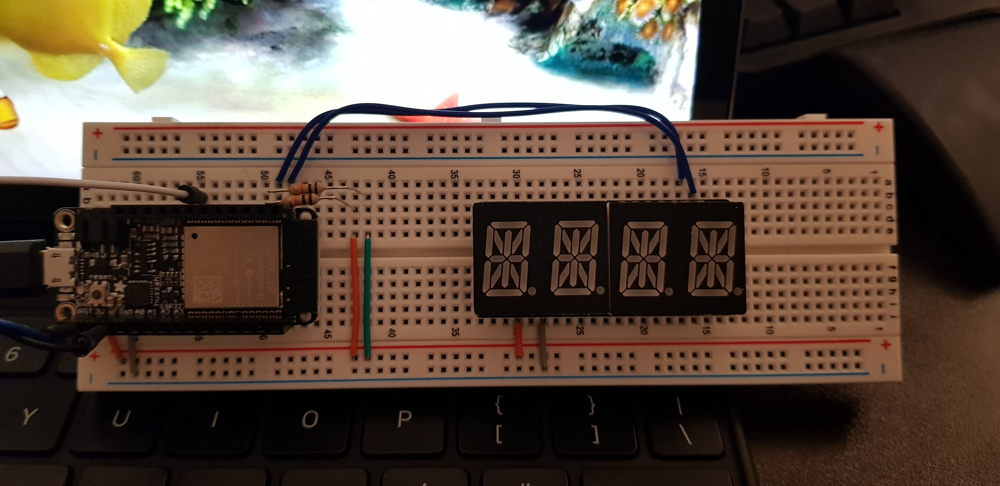
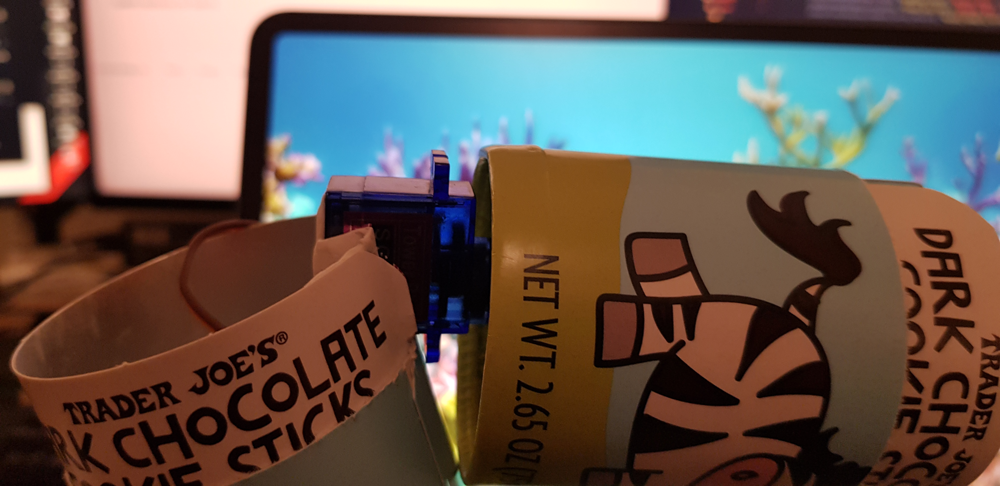
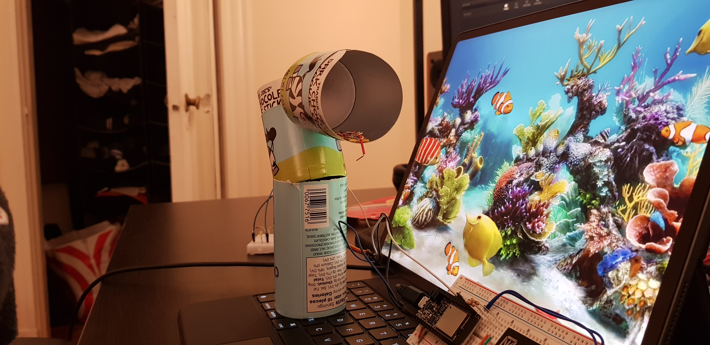
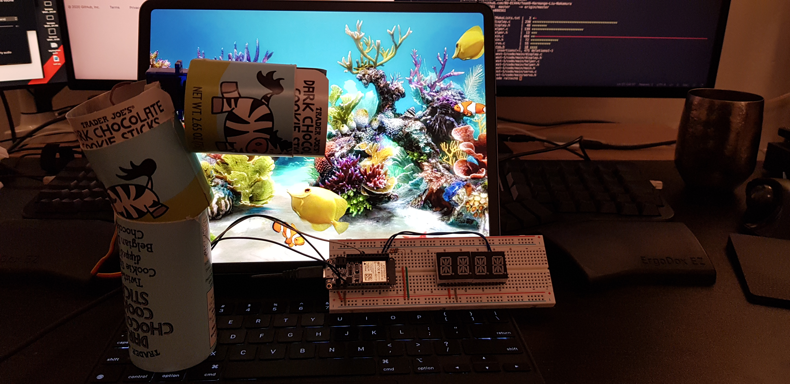

# Quest 1: Fish Feeder
Authors: Hayato Nakamura, Yang Hang Liu, Arnaud Harmange

Date: 2020-09-22
-----

## Summary
We used a ESP 32 to build a timer that controls a servo used to feed fish. At regular intervals, the servo will shake in order to release food. An alphanumeric display is used as a countdown until the next feeding.

## Self-Assessment

### Objective Criteria

| Objective Criterion | Rating | Max Value  | 
|---------------------------------------------|:-----------:|:---------:|
| Servo spins right then left three times without chatter at prescribed time intervals | 1 |  1     | 
| Alphanumeric display indicates hours and minutes | 1 |  1     | 
| Display shows countdown time report every second with no time loss  | 1 |  1     | 
| Food dispensed at specified times |1  |  1     | 
| Demo delivered at scheduled time and report submitted in team folder with all required components |  1|  1     | 
| Investigative question response | 1 |  1     | 
| Total Objective Criteria | 6 |  6    | 

### Qualitative Criteria

| Qualitative Criterion | Rating | Max Value  | 
|---------------------------------------------|:-----------:|:---------:|
| Quality of solution | 5 |  5     | 
| Quality of report.md including use of graphics |  3 |  3     | 
| Quality of code reporting | 3 |  3     | 
| Quality of video presentation | 3 |  3     | 
| Total Qualitative | 14 |  14    | 

## Solution Design
Our code comprises multiple independent modules in order to make it easy to maintain and extensible for future challenges. Specifically, there are four main modules:    
1. Timer module: Keep track of feeding time interval  
   - Implemented in display.c/.h  
2. Servo module: Rotate back and forth three times to feed fish  
   - Implemented in servo.c/.h  
3. Display module: Display the remaining time until the next feeding session  
   - Implemented in display.c/.h  
4. Helper module: Contains useful functions used by other modules  
   - Implemented in helper.c/.h  

For the wiring, we used jumpers to make it as simple as possible so that we can easily identify loosely connected parts.  
Finally, we attached paper bottles to the servo and demonstrated that it can properly dispense foods at the right time.  

## Sketches and Photos
Wiring for the alphanumerical display  

  

 

Close up to see where the servo will rotate  

  

 

How the food will be given to the fish  

  

 

Overview of entire setup  

  

 

## Supporting Artifacts
- [video presentation](https://youtu.be/JU_SeUDdLyM)  
  
- [video demonstration](https://www.youtube.com/watch?v=UpHU11wPk3A)  
  
- [Github Repo](https://github.com/BU-EC444/Team9-Harmange-Liu-Nakamura)

## References
Values for the 14-Segment Display: [GitHub repo link](https://github.com/dmadison/LED-Segment-ASCII/blob/master/14-Segment/14-Segment-ASCII_BIN.txt)

## References
Investigative question: What approach can you use to make setting the time interval dynamic (not hard coded)?  

We believe that a good way to implement setting the time interval, while also integrating what we learned from skills 10 and 11, would be through utilization of the pushbutton. We could make it so that each button press would increment the countdown timer by a certain amount, say 10 minutes. In order to decrement the interval, we could simply add a second button, or make it so that holding down the button would decrease it. By reflecting the interval change on the alphanumerical display, the user could easily control exactly how long they want their time interval to be.

-----

