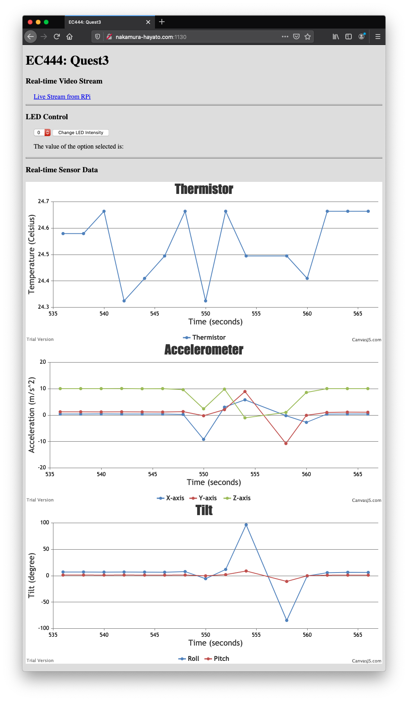

# Quest 3: Hurricane box
Authors: Hayato Nakamura, Yang Hang Liu, Arnaud Harmange

Date: 2020-10-22
-----

## Summary
In this quest, we utilized the ESP32 board, the accelerometer, and thermistor modules along with the rasperry pi and its camera module in order to create a "Hurricane box". This device connects wirelessly to a local network, transmitting the collected data from all sensors to the internet. This data can in turn be viewed romotely on a different network, both regressively and in real time if desired. Additionally, remote control of the device is possible, in this case in the form of modulating the LED intesity. 

## Self-Assessment

### Objective Criteria

| Objective Criterion                                                                                                   | Rating | Max Value  | 
|-----------------------------------------------------------------------------------------------------------------------|:-----------:|:---------:|
|Measures acceleration, temperature, and battery level                                                                   | 1 |  1     | 
| Displays real-time data at remote client via portal using separate IP network.                                         | 1 |  1     | 
| Controls LED on box from remote client via portal                                                                      | 1 |  1     | 
| Sources web cam video into remote client.                                                                              | 1 |  1     | 
| ESP32 and Rpi are connected wirelessly to router; ESP32 sensor data are delivered to local node server                 | 1 |  1     | 
| Demo delivered at scheduled time and report submitted in team folder with all required components                      | 1 |  1     | 
| Investigative question response                                                                                        | 1 |  1     | 

### Qualitative Criteria

| Qualitative Criterion | Rating | Max Value  | 
|---------------------------------------------|:-----------:|:---------:|
| Quality of solution | 5 |  5     | 
| Quality of report.md including use of graphics | 3 |  3     | 
| Quality of code reporting | 3 |  3     | 
| Quality of video presentation | 3 |  3     | 

## Solution Design
This code is broken down into individual components, each representing one of the pieces of the complete solution. 

[ESP32 Components](code/main)
1. main.c, main.h
   - Main function for the ESP32.
   - Initialize necessary modules and calls all other functions for the accelerometer, thermistor, and LED. 
   
2. accelerometer.c, accelerometer.h
   - Interprets changes measured by the ADXL343 accelerometer module and translates it into human readable units for the x, y, and z axes. 
   - Calculates pitch and roll information using the 3 axes.
   
3. ledc.c, ledc.h
   - Utilizes the ESP-IDF's LED Control module to power the LED. 
   - Setting different duty level allows the user to set the intensity of the LED. 
   
4. thermistor.c, thermistor.h
   - Responsible for translating voltage readings from the Thermistor module and translating it into usable engineering units (i.e., Celcius).
  
5. udp.c, udp.h
   - Responsible for establishing connection from ESP32 board to the local network.
   - Communicates the data collected from the sensors wirelessly over wifi using UDP protocol.

[Raspberry Pi Components](code/nodejs)
1. data_logger.js
   - Using UDP, it receives all the sensor readings from ESP32 over wifi. 
   - Formats the received UDP messages into json format, and stores them into datafile.json.
2. data_plotter.js
   - Reads json data from datafile.json, and display real-time plots of each sensor modules using CanvasJS. The plots updates itself every 2 seconds to show up-to-date information. 
   - Send the user input (LED Intensity from 0 to 9) to ESP32 using UDP over wifi to dynamically control the intensity of LED on the remote ESP32.
3. index.html
   - Design of web application for remote clients.
   - Displays real-time web camera video streaming from Raspberry Pi.
   - Dropdown menu to receive user input for LED intensity. 
   - Displays the real-time plots of thermistor, accelerometer, and tilt data.

## Sketches and Photos
System Diagram  

  

UI of Remote Client Application  

  

Wiring of RPi and ESP32

  

## Supporting Artifacts
- [Technical Video Demonstration](https://youtu.be/gacvtK-GVi4)  
  
- [Link to video demo](https://youtu.be/opBPuGserRw). Not to exceed 120s.   
  

## Investigative question
What are steps you can take to make your device and system low power?

   In a real-world implementation of the Hurricane box, and ideal solution would allow it to provide full functionality on minimal power, enabling long stretches of active time in the field without human intervention. While our current implementation does not consume inordinate amounts of power, certain changes can could certainly be made in order to improve the efficiency. The first and most obvious way to reduce power consumption would be to lengthen the time intervals between collection and transmission of data points. Whereas the current system continuously polls for data and updates every two seconds, and implementation that turns on data collection and transmission only once every five minutes (or less frequently) would result in significantly reduced power consumption over time. Depending on how long the time between data collection points, implementing a "deep-sleep" mode on the ESP32 could be implemented, allowing for even lower power consumption overall. Additonally, the camera on the Raspberry pi could be turned off completely unless a user requests live video. This way, the camera does not have to be perpetually on for no reason. A more refined implementation would be to utilize the accelerometer module to detect vibrations or significant movements, and sending a UDP request to the Pi, waking up the camera to record any potentially important events. This would cut down on the amount of unncessary recording and only capture the potentially most important moments. Finally, if the goal is to truly minimize power to an extreme, unutilized ports on the Pi such as the HDMI port can be turned off entirely, since they passively consume power even when not in use. The cpu can be throttled and the on board LEDs can also be turned off to further reduce power consumption. Additionally, the current wiring of the "Hurricane box" relies on connections between wires and the breadboard, which is inherently less efficient than directly wiring and soldering the componenets together directly. This could be done in a more permanent installation to improve efficiency even further. 
   
   ## Sources:
   
   https://randomnerdtutorials.com/esp32-deep-sleep-arduino-ide-wake-up-sources/
   
   https://learn.pi-supply.com/make/how-to-save-power-on-your-raspberry-pi/
   

## Modules, Tools, Source Used Including Attribution
- Attribution
  - [UDP Client Example Code](https://github.com/espressif/esp-idf/tree/release/v3.3/examples/protocols/sockets/udp_client)
    - Release for Version > 4.0 does not work because of library issue. v3.3 works fine.
  - [UDP Server Example Code](https://github.com/espressif/esp-idf/tree/release/v3.3/examples/protocols/sockets/udp_server)
    - Release for Version > 4.0 does not work because of library issue. v3.3 works fine.
  - [How TO - Range Sliders](https://www.w3schools.com/howto/howto_js_rangeslider.asp)
    - Range slider interface to specify LED intensity value.
  - [Extracting POST Data](https://stackabuse.com/get-http-post-body-in-express-js/)
    - Post user input values from html file to node.js file that server is running on.
  - [UDP in node.js](https://nodejs.org/api/dgram.html)

## References
- https://randomnerdtutorials.com/esp32-deep-sleep-arduino-ide-wake-up-sources/
- https://learn.pi-supply.com/make/how-to-save-power-on-your-raspberry-pi/ 
- https://github.com/espressif/esp-idf/tree/release/v3.3/examples/protocols/sockets/udp_client
- https://github.com/espressif/esp-idf/tree/release/v3.3/examples/protocols/sockets/udp_server
- https://www.w3schools.com/howto/howto_js_rangeslider.asp
- https://stackabuse.com/get-http-post-body-in-express-js/
- https://nodejs.org/api/dgram.html
-----

