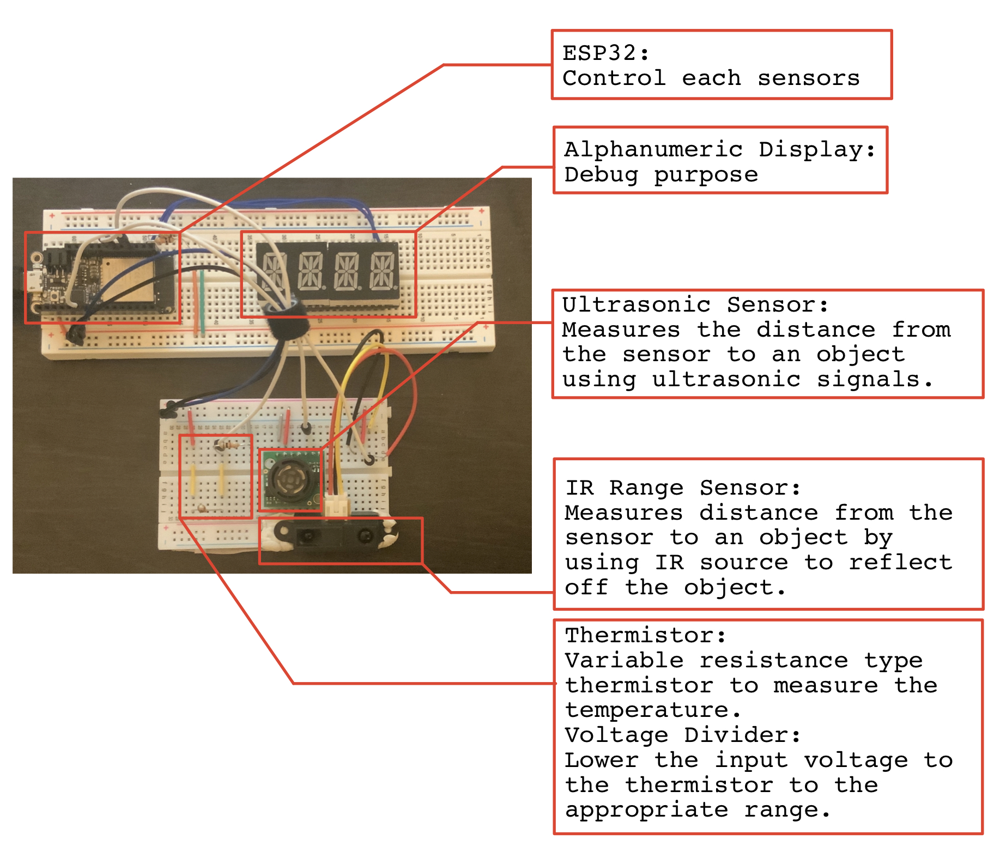
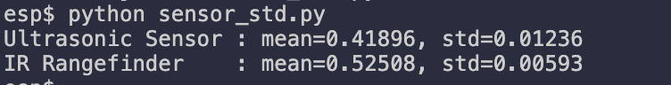

# Tactile Internet
Authors: Hayato Nakamura, Yang Hang Liu, Arnaud Harmange

Date: 2020-10-06
-----

## Summary
We used ESP32 and three sensors (i.e., thermistor, ultrasonic sensor, and IR rangefinder) to develop Tactile Internet. ESP32 gets sensor data from each sensor, and it plots them on website nicely using Node.js and CanvasJS. The program saves measured data into json files.

## Self-Assessment

### Objective Criteria

| Objective Criterion | Rating | Max Value  | 
|---------------------------------------------|:-----------:|:---------:|
| Periodic reporting of ultrasonic range in m |  1 |  1    | 
| Periodic reporting of IR range in m | 1 |  1     | 
| Periodic reporting of temperature in C | 1 |  1     | 
| Results displayed at host as text | 1 |  1     | 
| Results graphed at host continuously based on reporting period | 1 |  1     | 
| Demo delivered at scheduled time and report submitted in team folder with all required components | 1 |  1     | 
| Investigative question response | 1 |  1     | 
| Total Objective Criteria | 6 |  6    | 

### Qualitative Criteria

| Qualitative Criterion | Rating | Max Value  | 
|---------------------------------------------|:-----------:|:---------:|
| Quality of solution | 5 |  5     | 
| Quality of report.md including use of graphics | 3 |  3     | 
| Quality of code reporting | 3 |  3     | 
| Quality of video presentation | 3 |  3     | 
| Total Qualitative | 14 |  14    | 

## Solution Design
The code can essentially be broken down into four parts: the main function which recieves and manipulates all of the raw data from the sensors, the data logger file which takes serial output data and formats them into a JSON file, the data plotter file which reads data from the aforementioned JSON file, and defines the basic website structure. Finally, the index.html file is responsible for displaying all of the data points from the different sensors in a continuous and easy to read manner. The graph updates every two seconds, displaying up to 100 data points at any given time. 

1. main.c, main.h
   - recieves raw data from themistor, infrared, and ultrasonic sensors, and converts the voltages into the appropriate enginnering units. Outputs the data as well as time elapsed.
2. data_logger.js  
   - Javascript file which reads the serial output from the main function and formats it into a JSON file. 
3. data_plotter.js
   - Reads the JSON file created by the data_logger.js script, defines website structure, and calls the index.html file.
4. index.html
   - formats the sensor values into easy to read graphs which are updated every two seconds, displaying up to 100 data points at a time.

## Sketches and Photos
Graphs displaying the sensor data over time

  

 

Photo of breadboard wiring with labels (System Sketch)

  

 

## Supporting Artifacts
- [Link to video demo](https://youtu.be/6UAiDbjrMcM).  
  .  
- [Technical video demonstration (long ver. 86s)](https://youtu.be/dWaOPZRTvDU).  
  ")  
- [Technical video demonstration (short ver. 43s)](https://youtu.be/kSt4BIX907k).  
  ")  

## Modules, Tools, Source Used Including Attribution
Modules
- ADC
- Voltage Divider for thermistor
- Thermistor
- Ultrasonic Range Sensor
- IR Range Sensor
- node.js
- CanvasJS

Attribution
- [Steinhart & Hart Coeffs for 10k Thermistors](https://www.skyeinstruments.com/wp-content/uploads/Steinhart-Hart-Eqn-for-10k-Thermistors.pdf)
- [Steinhart-Hart Equation](https://en.wikipedia.org/wiki/Steinhart%E2%80%93Hart_equation)
- [Make an Arduino Temperature Sensor](https://create.arduino.cc/projecthub/iasonas-christoulakis/make-an-arduino-temperature-sensor-thermistor-tutorial-b26ed3)
- [Ultrasonic Sensor Quick Start Guide – HRLV‑MaxSonar‑EZ](https://www.maxbotix.com/ultrasonic-sensor-hrlv%E2%80%91maxsonar%E2%80%91ez-guide-158)

## References ##
Investigative question: Tabulate and compare the accuracy and speed of the IR and ultrasonic sensors. Which one would you prefer to use to support driving a robotic car? 

  The python [script](code/investigative/sensor_std.py) reads the json data file, and it computes mean and standard deviations for each sensors.  
    
  For this calculation, we placed an object in front of each sensors for about 300 seconds. This way, we can find the measurement stability of each sensor.
  Comparing the data collected from the IR and ultrasonic sensors, it is clear that the IR sensor would be better suited for the task of driving a robotic car because the IR sensor has less variations in measurements (i.e., more stable measurement) than the ultrasonic sensor. Additionally, data from the ultrasonic sensor is recorded every 100ms whereas the IR sensor is capable of collecting data once every 40ms. Considering that a car is a moving object and is likely to encounter other moving objects and rapidly changing ranges between itself and other objects, a sensor capable of more rapidly and accurately detecting changes in distance is the obvious choice. 

-----

